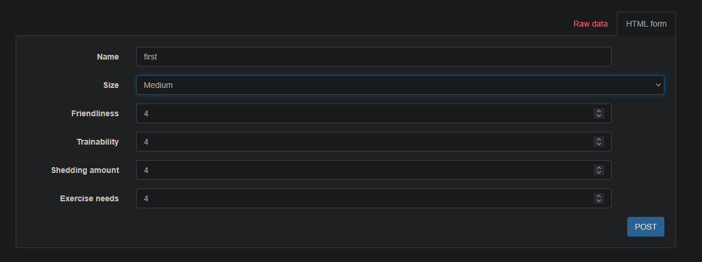
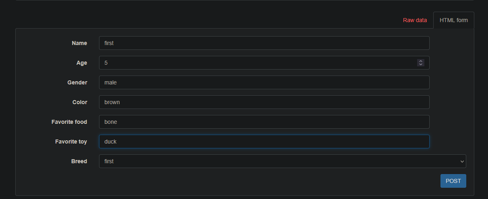

# Как запустить приложение

### 1. Зайти в папку dog_and_breed
```bash
cd dog_and_breed
```

## 2. Создать свой .env на основе .env.example

### 3. Остановить предыдущие контейнеры (если были)
```bash
docker compose down
```

### 4. Собрать и запустить
```bash
docker compose up --build -d
```

### 5. Выполнить миграции
```bash
docker compose exec web python manage.py migrate
```

### 6. Зайти по ссылке
```bash
http://localhost:8000/api/
```

### Как провести тесты
```bash
docker compose exec web python manage.py test dogapp
```

# Примеры

### Создать породу:

### Вывод:
```json
{
    "id": 1,
    "dogs_count": 0,
    "name": "first",
    "size": "Medium",
    "friendliness": 4,
    "trainability": 4,
    "shedding_amount": 4,
    "exercise_needs": 4
}
```

### Создать собаку:

#### Вывод:
```json
{
    "id": 1,
    "name": "first",
    "age": 5,
    "gender": "male",
    "color": "brown",
    "favorite_food": "bone",
    "favorite_toy": "duck",
    "breed": 1
}
```

### Создадим несколько пород
```json
 {
        "id": 1,
        "dogs_count": 3,
        "name": "first",
        "size": "Medium",
        "friendliness": 4,
        "trainability": 4,
        "shedding_amount": 4,
        "exercise_needs": 4
    },
    {
        "id": 2,
        "dogs_count": 2,
        "name": "second",
        "size": "Large",
        "friendliness": 2,
        "trainability": 4,
        "shedding_amount": 4,
        "exercise_needs": 4
    }
```
### Также создадим несколько собак:
```json
[
    {
        "id": 1,
        "avg_breed_age": 3,
        "name": "eqweq",
        "age": 2,
        "gender": "ewq",
        "color": "ewq",
        "favorite_food": "ewq",
        "favorite_toy": "eqw",
        "breed": 1
    },
    {
        "id": 2,
        "avg_breed_age": 3,
        "name": "eqweqq",
        "age": 2,
        "gender": "ewq",
        "color": "ewq",
        "favorite_food": "ewq",
        "favorite_toy": "eqw",
        "breed": 1
    },
    {
        "id": 3,
        "avg_breed_age": 8,
        "name": "eqweqq",
        "age": 5,
        "gender": "ewq",
        "color": "ewq",
        "favorite_food": "ewq",
        "favorite_toy": "eqw",
        "breed": 2
    },
    {
        "id": 4,
        "avg_breed_age": 8,
        "name": "eqweqqww",
        "age": 12,
        "gender": "ewq",
        "color": "ewq",
        "favorite_food": "ewq",
        "favorite_toy": "eqw",
        "breed": 2
    },
    {
        "id": 5,
        "avg_breed_age": 3,
        "name": "first",
        "age": 5,
        "gender": "male",
        "color": "brown",
        "favorite_food": "bone",
        "favorite_toy": "duck",
        "breed": 1
    }
]
```
## Из примера видно что  avg_breed_age и dogs_count указываются корректно

### Посмотреть одну конкретную собаку (например первую) по ссылке http://localhost:8000/api/dogs/1/
#### Вывод:
```json
{
    "id": 1,
    "same_breed_count": 3,
    "name": "eqweq",
    "age": 2,
    "gender": "ewq",
    "color": "ewq",
    "favorite_food": "ewq",
    "favorite_toy": "eqw",
    "breed": 1
}
```
## Видно что вычисляется same_breed_count корректно


